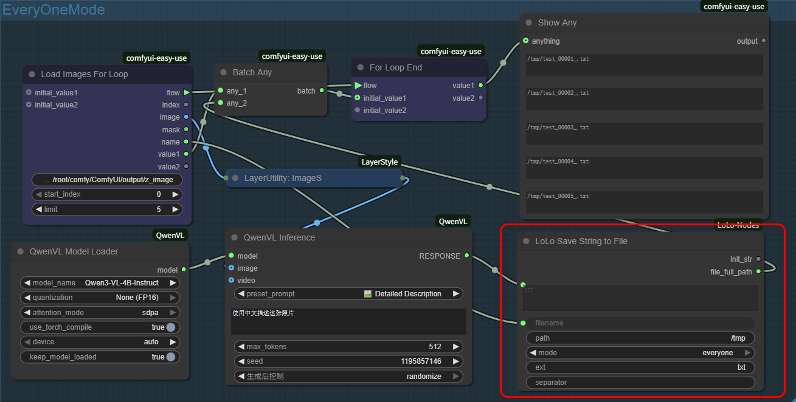
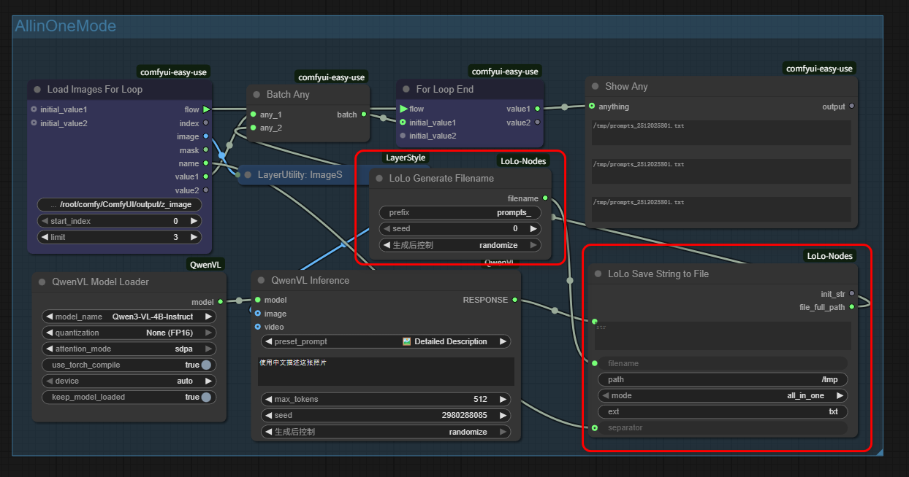
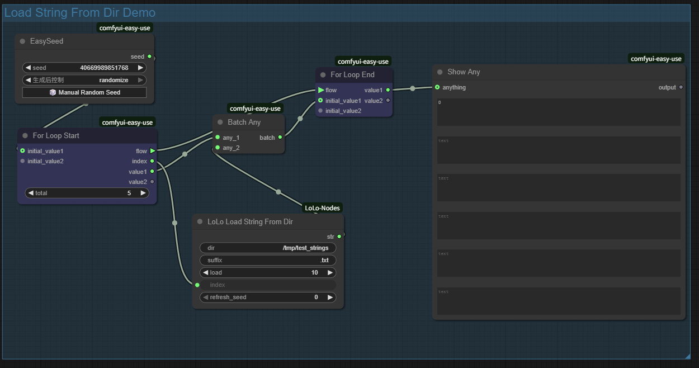
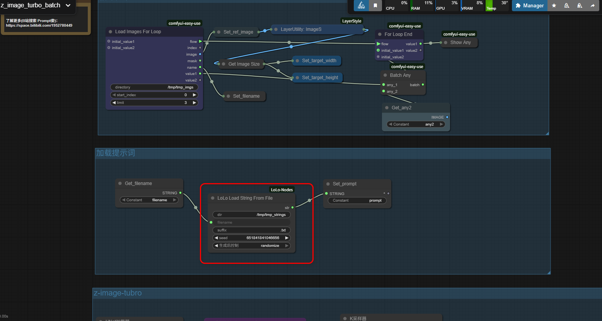

# ComfyUI-LoLo-Nodes

## 2025-12-02
本项目目的主要开发一些节点，服务于某些业务工作流。***目前开发的三个节点主要是为了配合https://github.com/yolain/ComfyUI-Easy-Use 中的For循环节点实现图片批量反推，反推出的内容进行保存*** 目前可以支持一对一文件保存，以及合并保存

### everyone 模式 每一张图片反推内容存入到单个文件，该文件以当前图片的文件名命名


### AllInOne 模式 所有图片的反推内容存入到一个文件中，追加内容时，通过“separator”字段内容进行分割


### 从目录中批量读取字符串，可稍微修改接入文生图流程，实现图片批量生成。


### 配合Z-Image-Turo 工作流实现批量图生图


## ✨ 功能简介
ComfyUI-LoLo-Nodes 目前提供了多个专注于文本文件处理的自定义节点，后续根据业务需要还可能加入其他类别的功能节点。目前开发的节点均位于节点菜单的 LoLo Nodes/Utils 分类下：

LoLo Save String to File： 将字符串以不同模式保存到文件。

LoLo Generate Filename： 生成基于时间戳的唯一文件名。

LoLo Load String From Dir： 从指定目录加载特定文件中的字符串。

LoLo Load String From File： 加载指定目录、文件名、文件后缀的文件中的字符串。

## 📦 安装方法

1. 进入你的 ComfyUI 根目录下的 custom_nodes 文件夹。
2. 使用 Git 克隆本仓库，或直接下载 ZIP 包并解压到此文件夹。
```
bash
cd ComfyUI/custom_nodes
git clone https://github.com/promptlo/ComfyUI-LoLo-Nodes.git

```
重启 ComfyUI。

## 🧩 节点详解
### LoLo Save String to File
将输入的字符串保存到指定的文件中，支持覆盖和追加两种模式。

输入参数：

str (STRING): 要保存的文本内容。

filename (STRING): 文件名（不含后缀）。

path (STRING): 文件保存的绝对或相对路径（如，windows下：d:\tmp; linux下：./output）。

mode (COMBO: [everyone, all_in_one]): 保存模式。

everyone: 总是创建/覆盖文件。

all_in_one: 如果文件已存在，则在末尾追加内容。

ext (STRING, 可选): 文件后缀，默认为 txt。

separator (STRING, 可选): 在 all_in_one 模式下，追加内容时使用此分隔符。

输出：

init_str (STRING): 返回输入的原始字符串。

file_full_path (STRING): 返回保存文件的完整绝对路径。

### LoLo Generate Filename
生成一个带有时间戳的唯一文件名，避免文件覆盖。

输入参数：

prefix (STRING): 文件名前缀（如 image_）。

输出：

filename (STRING): 生成的文件名，格式为 {prefix}YYMMDDHHMMSS（例如：image_251202143025）。


## LoLo Load String From Dir
从指定目录读取特定后缀的文件内容。

输入参数：

dir (STRING): 要读取的文件目录路径。

suffix (STRING): 目标文件的后缀名，默认为 .txt。

load (INT): 最大加载文件数量（例如设为10，则只处理目录下按名称排序后的前10个文件）。

index (INT): 要读取的文件的索引号（从0开始）。

输出：

str (STRING): 读取到的文件内容。

## LoLo Load String From File
从指定目录读取特定后缀的文件内容。

输入参数：

dir (STRING): 要读取的文件目录路径。

suffix (STRING): 目标文件的后缀名，默认为 .txt。

filename (STRING): 目标文件的名字，不包含后缀。

输出：

str (STRING): 读取到的文件内容。